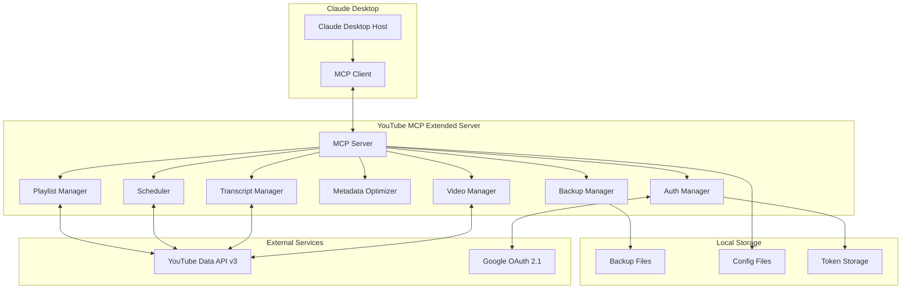

# Design Document

## Overview

The YouTube MCP Extended server implements the Model Context Protocol (MCP) specification version 2025-03-26 to provide Claude Desktop with comprehensive YouTube video management capabilities. The system extends an existing YouTube MCP server with advanced features including transcript integration, AI-powered metadata optimization, strategic scheduling, and playlist management.

The architecture follows current best practices from the context documentation, implementing OAuth 2.1 security standards, YouTube Data API v3 guidelines, and MCP Protocol specifications for seamless integration with Claude Desktop.

## Architecture

### High-Level Architecture



### MCP Protocol Implementation

Following MCP Protocol 2025-03-26 specification:

- **Transport Layer**: STDIO transport for local Claude Desktop integration
- **Communication**: JSON-RPC 2.0 protocol
- **Capabilities**: Tools (primary), Resources (video data), Prompts (workflow templates)
- **Session Management**: Proper initialization and capability negotiation

## MCP Tools, Resources, and Prompts

### Tools (Claude-Callable Functions)

| Tool Name | Description | Input Schema | Output |
|-----------|-------------|--------------|--------|
| `list_videos` | List YouTube videos with filtering | `{ maxResults?: number, status?: string, orderBy?: string }` | Array of Video objects |
| `get_video_transcript` | Retrieve transcript for a video | `{ videoId: string }` | Transcript object or null |
| `generate_metadata_suggestions` | Generate optimized metadata suggestions | `{ videoId: string, includeTranscript?: boolean }` | MetadataSuggestion object |
| `apply_metadata` | Apply metadata changes to video | `{ videoId: string, metadata: VideoMetadata }` | Success confirmation |
| `schedule_videos` | Schedule videos strategically | `{ videoIds: string[], config: ScheduleConfig }` | ScheduleResult object |
| `create_playlist` | Create new YouTube playlist | `{ title: string, description?: string, privacy?: string }` | Playlist object |
| `add_videos_to_playlist` | Add videos to playlist in order | `{ playlistId: string, videoIds: string[] }` | Success confirmation |
| `backup_video_metadata` | Create backup of current metadata | `{ videoId: string }` | Backup confirmation |
| `restore_video_metadata` | Restore from backup | `{ videoId: string, backupDate?: string }` | Restore confirmation |
| `get_batch_status` | Get status of running batch operation | `{ batchId: string }` | BatchStatus object |

### Resources (Data Sources)

| Resource URI | Description | Content Type |
|--------------|-------------|--------------|
| `youtube://videos` | List of user's YouTube videos | application/json |
| `youtube://channels/mine` | Current user's channel info | application/json |
| `youtube://playlists` | User's playlists | application/json |
| `batch://status/{batchId}` | Real-time batch operation status | application/json |
| `backups://list` | Available backup files | application/json |

### Prompts (Workflow Templates)

| Prompt Name | Description | Arguments |
|-------------|-------------|-----------|
| `optimize_video_batch` | Optimize metadata for multiple videos | `videoCount: number, categories?: string[]` |
| `schedule_content_calendar` | Create strategic publishing schedule | `timeframe: string, frequency: string` |
| `playlist_organization` | Organize videos into themed playlists | `theme: string, videoCount: number` |

## Components and Interfaces

### 1. MCP Server Core

**Responsibilities:**
- Handle MCP protocol communication
- Manage tool registration and execution
- Coordinate between internal components
- Implement proper error handling and logging

**Key Methods:**
```typescript
interface MCPServer {
  initialize(): Promise<InitializeResult>
  listTools(): Promise<ToolsListResult>
  callTool(request: CallToolRequest): Promise<CallToolResult>
  listResources(): Promise<ResourcesListResult>
  readResource(request: ReadResourceRequest): Promise<ReadResourceResult>
  // Subscription support for real-time updates
  subscribeToResource(uri: string): Promise<void>
  notifyResourceUpdate(uri: string): void
}
```

### 2. Authentication Manager

**Responsibilities:**
- Implement OAuth 2.1 with PKCE for enhanced security
- Manage token lifecycle (access, refresh, expiration)
- Handle browser-based authentication flow
- Secure token storage with encryption

**OAuth 2.1 Configuration:**
```typescript
interface OAuthConfig {
  clientId: string
  clientSecret: string
  redirectUri: string
  scopes: string[]
  accessType: 'offline'  // Critical for refresh tokens
  prompt: 'consent'      // Forces consent screen for refresh tokens
  usePKCE: true         // Enhanced security
}
```

**Token Management:**
```typescript
interface TokenManager {
  authenticate(): Promise<AuthResult>
  refreshToken(): Promise<TokenResult>
  validateToken(): Promise<boolean>
  revokeToken(): Promise<void>
}
```

### 3. Video Manager

**Responsibilities:**
- List and filter YouTube videos
- Update video metadata
- Handle video scheduling
- Manage privacy status changes

**Core Operations:**
```typescript
interface VideoManager {
  listVideos(filter: VideoFilter): Promise<Video[]>
  getVideo(videoId: string): Promise<Video>
  updateMetadata(videoId: string, metadata: VideoMetadata): Promise<void>
  scheduleVideo(videoId: string, publishAt: string): Promise<void>
  updatePrivacyStatus(videoId: string, status: PrivacyStatus): Promise<void>
}
```

### 4. Transcript Manager

**Responsibilities:**
- Retrieve YouTube-generated transcripts via API
- Parse and format transcript content
- Handle transcript availability checks
- Extract timestamps for metadata optimization

**Implementation:**
```typescript
interface TranscriptManager {
  getTranscript(videoId: string): Promise<Transcript | null>
  parseTranscript(rawTranscript: string): Promise<ParsedTranscript>
  extractTimestamps(transcript: ParsedTranscript): Promise<Timestamp[]>
}
```

### 5. Metadata Optimizer

**Responsibilities:**
- Generate SEO-optimized titles and descriptions
- Create relevant tags based on transcript content
- Generate thumbnail concepts
- Provide metadata suggestions for Claude review

**AI Integration:**
```typescript
interface MetadataOptimizer {
  generateSuggestions(videoId: string, transcript?: string): Promise<MetadataSuggestion>
  optimizeTitle(transcript: string, currentTitle: string): Promise<string>
  optimizeDescription(transcript: string, timestamps: Timestamp[]): Promise<string>
  generateTags(transcript: string): Promise<string[]>
  generateThumbnailConcepts(transcript: string): Promise<ThumbnailConcept>
}

interface MetadataSuggestion {
  videoId: string
  suggestions: {
    title: string
    description: string
    tags: string[]
    thumbnailConcept: ThumbnailConcept
  }
  rationale: string
  confidence: number
  requiresApproval: boolean
}
```

### 6. Scheduler

**Responsibilities:**
- Implement strategic video scheduling algorithms
- Handle time slot distribution
- Manage category-based scheduling
- Prevent scheduling conflicts

**Scheduling Logic:**
```typescript
interface Scheduler {
  scheduleVideos(videos: Video[], config: ScheduleConfig): Promise<ScheduleResult>
  validateSchedule(schedule: Schedule): Promise<ValidationResult>
  distributeTimeSlots(videos: Video[], slots: TimeSlot[]): Promise<Distribution>
}

interface ScheduleConfig {
  mode: 'suggest' | 'apply'
  timeSlots?: string[]
  publishDays?: string[]
  minSpacing?: number
  timezone?: string
  categories?: CategorySchedule[]
  skipScheduling?: boolean
  manualTimestamps?: { [videoId: string]: string }
}
```

### 7. Playlist Manager

**Responsibilities:**
- Create and manage YouTube playlists
- Add videos to playlists in specified order
- Update playlist metadata
- Handle playlist privacy settings

**Interface:**
```typescript
interface PlaylistManager {
  createPlaylist(title: string, description?: string, privacy?: string): Promise<Playlist>
  appendVideos(playlistId: string, videoIds: string[]): Promise<void>
  setMetadata(playlistId: string, metadata: PlaylistMetadata): Promise<void>
  getPlaylist(playlistId: string): Promise<Playlist>
  listPlaylists(): Promise<Playlist[]>
}

### 8. Backup Manager

**Responsibilities:**
- Create backups of original metadata before changes
- Organize backups by date and video ID
- Provide restore functionality
- Manage backup file lifecycle

**Backup Structure:**
```
backups/
├── 2025-09-26/
│   ├── videoId1.json
│   ├── videoId2.json
│   └── batch_metadata.json
├── 2025-09-27/
│   └── videoId3.json
└── retention_policy.json
```

**Interface:**
```typescript
interface BackupManager {
  createBackup(videoId: string, metadata: VideoMetadata): Promise<string>
  restoreFromBackup(videoId: string, backupDate?: string): Promise<VideoMetadata>
  listBackups(videoId?: string): Promise<BackupInfo[]>
  cleanupOldBackups(retentionDays: number): Promise<void>
}

interface BackupInfo {
  videoId: string
  backupDate: string
  backupPath: string
  originalMetadata: VideoMetadata
}

## Data Models

### Video Model
```typescript
interface Video {
  id: string
  title: string
  description: string
  tags: string[]
  categoryId: string
  privacyStatus: 'private' | 'unlisted' | 'public'
  publishedAt?: string
  scheduledStartTime?: string
  thumbnails: Thumbnails
  statistics: VideoStatistics
}

interface VideoMetadata {
  title: string
  description: string
  tags: string[]
  categoryId: string
  privacyStatus?: 'private' | 'unlisted' | 'public'
  scheduledStartTime?: string
}

interface Thumbnails {
  default: ThumbnailInfo
  medium: ThumbnailInfo
  high: ThumbnailInfo
  standard?: ThumbnailInfo
  maxres?: ThumbnailInfo
}

interface ThumbnailInfo {
  url: string
  width: number
  height: number
}

interface VideoStatistics {
  viewCount: string
  likeCount: string
  commentCount: string
}
```

### Transcript Model
```typescript
interface Transcript {
  videoId: string
  language: string
  content: TranscriptSegment[]
  duration: number
}

interface TranscriptSegment {
  start: number
  duration: number
  text: string
}
```

### Backup Model
```typescript
interface VideoBackup {
  videoId: string
  originalMetadata: VideoMetadata
  timestamp: string
  backupPath: string
}
```

### Scheduling Models
```typescript
interface ScheduleResult {
  scheduledVideos: ScheduledVideo[]
  conflicts: ScheduleConflict[]
  summary: ScheduleSummary
}

interface ScheduledVideo {
  videoId: string
  publishAt: string
  timeSlot: string
  category?: string
}

interface ScheduleConflict {
  videoId: string
  requestedTime: string
  actualTime: string
  reason: string
}

interface ScheduleSummary {
  totalVideos: number
  successfullyScheduled: number
  conflicts: number
  dateRange: { start: string; end: string }
}

interface Distribution {
  timeSlots: TimeSlotDistribution[]
  categories: CategoryDistribution[]
  conflicts: string[]
}

interface TimeSlotDistribution {
  slot: string
  assignedVideos: string[]
  capacity: number
}

interface CategoryDistribution {
  category: string
  videos: string[]
  preferredSlots: string[]
}
```

## Error Handling

### YouTube API Error Management

Following YouTube Data API v3 best practices:

```typescript
class YouTubeAPIHandler {
  async executeWithRetry<T>(operation: () => Promise<T>): Promise<T> {
    const maxRetries = 5
    
    for (let attempt = 0; attempt < maxRetries; attempt++) {
      try {
        return await operation()
      } catch (error) {
        if (this.shouldRetry(error)) {
          const delay = Math.pow(2, attempt) + Math.random()
          await this.sleep(delay * 1000)
          continue
        }
        throw error
      }
    }
    
    throw new Error('Max retries exceeded')
  }
  
  private shouldRetry(error: any): boolean {
    const retryableCodes = [429, 500, 502, 503, 504]
    return retryableCodes.includes(error.status)
  }
}
```

### Quota Management

```typescript
class QuotaManager {
  private dailyQuota = 10000
  private usedQuota = 0
  
  async checkQuota(operation: string): Promise<boolean> {
    const cost = this.getOperationCost(operation)
    return (this.usedQuota + cost) <= this.dailyQuota
  }
  
  private getOperationCost(operation: string): number {
    const costs = {
      'videos.list': 1,
      'videos.update': 50,
      'videos.insert': 1600,
      'search.list': 100,
      'playlists.insert': 50
    }
    return costs[operation] || 1
  }
}
```

## Testing Strategy

### Unit Testing

- **Component Isolation**: Test each manager independently
- **Mock External APIs**: Use mocks for YouTube API and OAuth
- **Error Scenarios**: Test all error conditions and edge cases
- **Token Management**: Test token refresh and expiration scenarios

### Integration Testing

- **MCP Protocol Compliance**: Verify JSON-RPC 2.0 communication
- **OAuth Flow**: Test complete authentication process
- **API Integration**: Test YouTube API interactions with rate limiting
- **End-to-End Workflows**: Test complete video processing workflows

### Test Structure

```typescript
describe('VideoManager', () => {
  describe('listVideos', () => {
    it('should return videos with proper filtering')
    it('should handle API errors gracefully')
    it('should respect quota limits')
  })
  
  describe('updateMetadata', () => {
    it('should create backup before updating')
    it('should handle validation errors')
    it('should retry on transient failures')
  })
})
```

### Performance Testing

- **Batch Operations**: Test processing multiple videos efficiently
- **Rate Limiting**: Verify proper handling of API rate limits
- **Memory Usage**: Monitor memory consumption during large operations
- **Concurrent Requests**: Test handling of multiple simultaneous operations

## Security Considerations

### OAuth 2.1 Security

- **PKCE Implementation**: Mandatory for all OAuth flows
- **State Parameter**: CSRF protection for all authorization requests
- **Token Storage**: Encrypted storage of refresh tokens
- **Scope Minimization**: Request only necessary permissions

### Data Protection

- **Token Encryption**: AES-256 encryption for stored tokens
- **Backup Security**: Secure storage of metadata backups
- **Input Validation**: Comprehensive validation of all inputs
- **Error Information**: Avoid exposing sensitive data in error messages

### API Security

- **Rate Limiting**: Implement client-side rate limiting
- **Quota Monitoring**: Track and respect API quotas
- **Request Validation**: Validate all API requests before sending
- **Error Handling**: Secure error handling without information leakage

## Configuration Management

### Environment Variables

```bash
# OAuth Configuration
YOUTUBE_CLIENT_ID=your-client-id
YOUTUBE_CLIENT_SECRET=your-client-secret
YOUTUBE_REDIRECT_URI=http://localhost:3000/callback

# Storage Paths
BACKUP_PATH=./backups
TOKEN_STORAGE_PATH=./tokens
CONFIG_PATH=./config

# Security
ENCRYPTION_KEY=your-encryption-key
SESSION_SECRET=your-session-secret

# API Configuration
YOUTUBE_API_QUOTA_LIMIT=10000
RATE_LIMIT_REQUESTS_PER_MINUTE=60
```

### MCP Server Configuration

```json
{
  "mcpServers": {
    "youtube-extended": {
      "command": "node",
      "args": ["./dist/index.js"],
      "env": {
        "YOUTUBE_CLIENT_ID": "your-client-id",
        "YOUTUBE_CLIENT_SECRET": "your-client-secret",
        "BACKUP_PATH": "/absolute/path/to/backups",
        "TOKEN_STORAGE_PATH": "/absolute/path/to/tokens"
      }
    }
  }
}
```

## Deployment Considerations

### Development Setup

- **Local OAuth**: Configure localhost redirect URIs
- **Development Tokens**: Use testing app status for development
- **Debug Logging**: Enhanced logging for development debugging
- **Hot Reload**: Support for development iteration

### Production Deployment

- **App Verification**: Move OAuth app to "Published" status
- **HTTPS Requirements**: Ensure all redirect URIs use HTTPS
- **Token Persistence**: Implement robust token storage
- **Monitoring**: Add comprehensive logging and monitoring
- **Backup Strategy**: Implement backup retention policies

### Scalability Considerations

- **Concurrent Users**: Design for multiple user sessions
- **Resource Management**: Efficient memory and CPU usage
- **Database Integration**: Optional database for larger deployments
- **Caching Strategy**: Cache frequently accessed data#
## Playlist Models
```typescript
interface Playlist {
  id: string
  title: string
  description: string
  privacyStatus: 'private' | 'unlisted' | 'public'
  itemCount: number
  thumbnails: Thumbnails
  createdAt: string
}

interface PlaylistMetadata {
  title: string
  description: string
  privacyStatus?: 'private' | 'unlisted' | 'public'
}
```

### Thumbnail Models
```typescript
interface ThumbnailConcept {
  headline: string
  visualCues: string[]
  ctaText: string
  colorScheme: string
  composition: string
  rationale: string
}
```

### Batch Operation Models
```typescript
interface BatchStatus {
  batchId: string
  operation: string
  status: 'pending' | 'running' | 'completed' | 'failed'
  progress: {
    total: number
    completed: number
    failed: number
    current?: string
  }
  results: BatchResult[]
  startedAt: string
  completedAt?: string
  error?: string
}

interface BatchResult {
  videoId: string
  status: 'success' | 'failed' | 'skipped'
  result?: any
  error?: string
}
```

## Real-Time Progress Updates

### Resource Subscription Implementation

Following MCP Protocol 2025-03-26 subscription capabilities:

```typescript
// Claude subscribes to batch status updates
await mcp.subscribeToResource('batch://status/batch_123')

// Server sends notifications as batch progresses
server.notification({
  method: 'notifications/resources/updated',
  params: {
    uri: 'batch://status/batch_123'
  }
})
```

### Progress Streaming

```typescript
class BatchProcessor {
  async processBatch(videos: Video[], operations: string[]): Promise<string> {
    const batchId = generateBatchId()
    
    // Start processing in background
    this.processInBackground(batchId, videos, operations)
    
    return batchId
  }
  
  private async processInBackground(batchId: string, videos: Video[], operations: string[]) {
    const status: BatchStatus = {
      batchId,
      operation: operations.join(', '),
      status: 'running',
      progress: { total: videos.length, completed: 0, failed: 0 },
      results: [],
      startedAt: new Date().toISOString()
    }
    
    for (const video of videos) {
      status.progress.current = video.id
      this.updateBatchStatus(batchId, status)
      
      try {
        const result = await this.processVideo(video, operations)
        status.results.push({ videoId: video.id, status: 'success', result })
        status.progress.completed++
      } catch (error) {
        status.results.push({ videoId: video.id, status: 'failed', error: error.message })
        status.progress.failed++
      }
      
      // Notify Claude of progress update
      this.server.notifyResourceUpdate(`batch://status/${batchId}`)
    }
    
    status.status = 'completed'
    status.completedAt = new Date().toISOString()
    this.updateBatchStatus(batchId, status)
  }
}